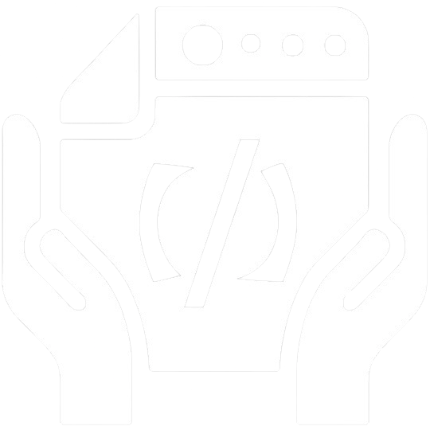

<svg xmlns="http://www.w3.org/2000/svg" width="100%" height="100">
  <foreignObject width="100%" height="100%">
    <div xmlns="http://www.w3.org/1999/xhtml" style="display: flex; justify-content: space-between; align-items: center; width: 100%; height: 100%;">
      <div style="display: flex; align-items: center;">
        <a href="https://github.com/garzione/WebToLLM">
          
        </a>
        <span style="font-size: 2em; font-weight: bold; margin-left: 10px;">WebToLLM</span>
      </div>
      <div style="display: flex; flex-direction: column; align-items: flex-end;">
        
        
      </div>
    </div>
  </foreignObject>
</svg>

## Description

**WebToLLM** is a robust Chrome extension engineered to simplify the capture, download, and copying of webpage elements, including HTML and CSS, for integration with large language models to replicate designs. Perfect for developers, designers, and researchers, this tool enables users to seamlessly extract and save webpage content, providing quick access to essential data.

## Development


Contributions are welcome! Please fork the repository and submit pull requests!

## Supported Browsers

<p align="left">
<a href="https://www.google.com/chrome/" target="_blank"></a>
</p>

## Technologies

<p align="left">
<a href="https://developer.mozilla.org/en-US/docs/Web/JavaScript" target="_blank"></a>
<a href="https://developer.mozilla.org/en-US/docs/Web/HTML" target="_blank"></a>
<a href="https://developer.mozilla.org/en-US/docs/Web/CSS" target="_blank"></a>
<a href="https://developer.chrome.com/docs/extensions/mv3/" target="_blank"></a>
<a href="https://html2canvas.hertzen.com/" target="_blank"></a>
</p>

## Table of Contents

- [Description](#description)
- [Development](#development)
- [Supported Browsers](#supported-browsers)
- [Technologies](#technologies)
- [Table of Contents](#table-of-contents)
- [Installation](#installation)
- [Features](#features)
- [Notifications](#notifications)
- [Debugging](#debugging)
- [Screenshots](#screenshots)
- [Structure](#structure)

## Installation

Follow these steps to install the extension:

1. Download the extension package from the official website
2. Open Chrome and go to <kbd> chrome://extensions/ </kbd>
3. Enable "Developer mode" by toggling the switch in the top-right corner
4. Click "Load unpacked" and select the downloaded extension package
5. The extension should now be installed and ready to use

## Features

- **Capture Element**: <kbd>ctrl</kbd> + <kbd>shift</kbd> + <kbd>x</kbd>

  - Select any element on a webpage to capture its content and styles. Press the shortcut to enter capture mode, use the arrow keys to navigate, and press <kbd>enter</kbd> to confirm the selection.

- **Toggle Popup**: <kbd>ctrl</kbd> + <kbd>shift</kbd> + <kbd>x</kbd>

  - Open the popup by clicking on the extension icon or using the shortcut. Choose the desired format (JSON, Text, PNG) and click the corresponding button.

- **Download Data**:

  - Save captured data in JSON, text, or PNG formats by using the popup menu.

- **Copy to Clipboard**:

  - Easily copy captured data to the clipboard for quick pasting by using the popup menu.

- **Visual Notifications**:
  - Receive color-coded notifications for all actions, indicating success or failure.

## Notifications

<!-- Success Notification -->
<p style="background-color: #4CAF50; color: white; padding: 5px; border-radius: 4px; display: inline-block;">
  
  Example success notification!
</p>

<!-- Failure Notification -->
<p style="background-color: #F44336; color: white; padding: 5px; border-radius: 4px; display: inline-block;">
  
  Example failure notification.
</p>

## Debugging

- For general extension health: <kbd> chrome://extensions/ </kbd>
- For popup / frontend debugging: <kbd>ctrl</kbd> + <kbd>shift</kbd> + <kbd>i</kbd> > Console Tab
- For backend debugging: Open the extension > right click > inspect > Console Tab

## Screenshots

<p>
Coming soon!
</p>

## Structure

```
WebToLLM
├── .github
│   ├── repo-info.yaml
│   └── workflows
│       ├── update-docs.yml
│       └── update-repo-info.yml
├── .gitignore
├── README.md
├── css
│   └── overlay.css
├── docs
│   ├── CNAME
│   ├── icons
│   │   ├── copy-clipboard.png
│   │   ├── download-image.png
│   │   ├── download-json.png
│   │   ├── download-text.png
│   │   └── logo
│   │       ├── web2llm.gif
│   │       ├── web2llm.png
│   │       ├── web2llm_mini.png
│   │       └── web2llm_mini_dark.png
│   └── index.html
├── libs
│   └── html2canvas.min.js
├── manifest.json
├── popup.html
├── popup.js
└── scripts
    ├── background.js
    ├── content_script.js
    └── logging.js
```

---

<!-- <div style="text-align: left; display: flex; flex-direction: column; align-items: center; margin-top: 20px;">
  <div style="text-align: center; margin-bottom: 5px;">
    <a href="https://github.com/garzione" target="_blank" style="text-decoration: none; color: black;">
      
      <p style="margin-top: 5px; color: white; font-size: 1.2em;">@garzione</p>
    </a>
    <a href="https://www.buymeacoffee.com/garzione" target="_blank"></a>

  </div>
  <div style="display: flex; flex-wrap: wrap; gap: 10px; justify-content: center;">
    <a href="https://garzi.one" target="_blank">
      
    </a>
    <a href="https://x.com/garzione" target="_blank">
      
    </a>
    <a href="https://huggingface.co/garzione" target="_blank">
      
    </a>
    <a href="https://www.linkedin.com/in/justingarzione/" target="_blank">
      
    </a>
  </div>
</div> -->

<iframe src="https://garzione.github.io/readme-footer/" width="100%" height="300px"style="border:none;"></iframe>
